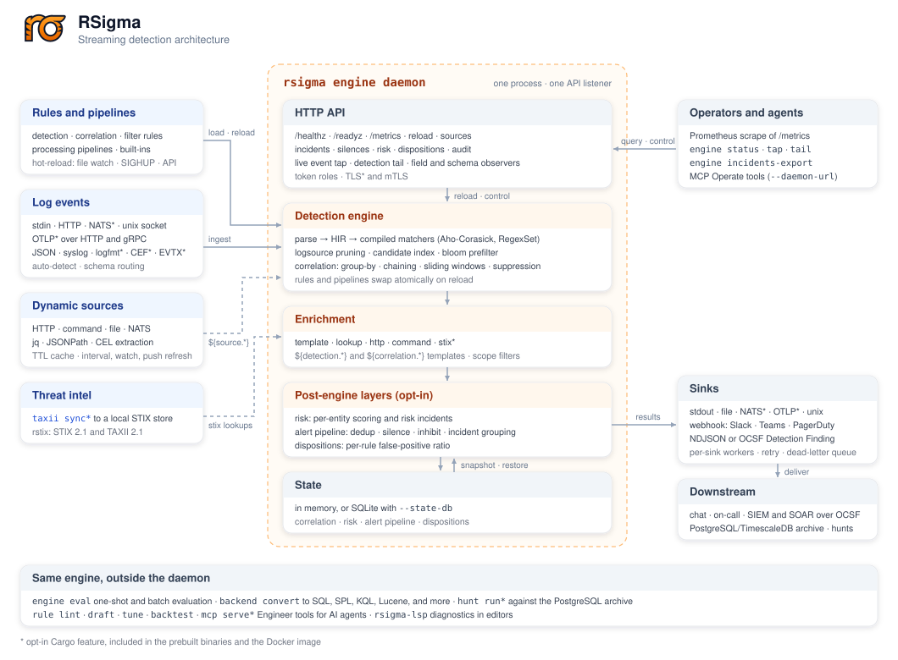
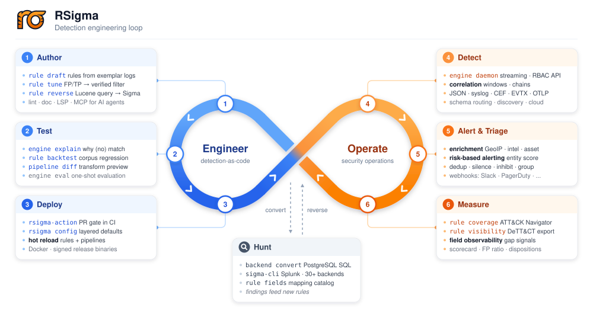

<!-- _class: title -->
<!-- _paginate: false -->


<div class="kicker">LSS EU · Prague · 8 October 2026</div>

# Detection Engineering with RSigma

<p class="lede">Portable detections on Linux, from kernel telemetry to one higher-confidence alert.</p>

Mostafa Moradian

<div class="pills">
  <span class="pill">Sigma</span>
  <span class="pill">Linux telemetry</span>
  <span class="pill">Stateful correlation</span>
</div>

<!-- 0:00-0:10. Welcome everyone. This is a detection-engineering talk told through one Linux incident. -->

---

<!-- Personalize the details on this slide before the event. -->

<div class="kicker">01 · Opening</div>

## About me

<div class="columns">
<div class="card accent">

### Mostafa Moradian

**Creator and maintainer of RSigma**

- 15+ years of experience
- Head of Security at Tiger Data
- OSS developer and maintainer (@mostafa)
- Stockholm, Sweden

</div>
<div class="card">

### Why I built RSigma

- Already built similar tooling at Grafana
- Portable Sigma execution without a SIEM
- Fast, inspectable tooling written in Rust
- Reproducible detection engineering workflows

</div>
</div>

<!-- 0:10-0:25. Keep this personal and brief. Explain why you care about portable detection and reproducible security tooling, then move straight to the result. -->

---

<div class="kicker">01 · Opening</div>

## One alert

```json
{
  "title": "Linux Discovery-to-Execution Sequence",
  "level": "critical",
  "host": "lss-demo",
  "user": "1001",
  "signals": 4,
  "window": "60s"
}
```

<div class="callout"><strong>No SIEM.</strong> No vendor query language. One local process.</div>

<!-- 0:25-1:15. Read only the important fields: one critical result, one host, one user, four contributing signals, sixty seconds. There is no remote query service behind this output. It came from one process next to the telemetry source. -->

---

<div class="kicker">01 · Opening</div>

## Four ordinary signals

<div class="card-grid four">
  <div class="card">
    <span class="card-number">1</span>
    <h3>Discovery</h3>
    <p>Identify the current account and host context.</p>
  </div>
  <div class="card">
    <span class="card-number">2</span>
    <h3>Download</h3>
    <p>Fetch a payload with a command-line tool.</p>
  </div>
  <div class="card">
    <span class="card-number">3</span>
    <h3>Permission</h3>
    <p>Make the staged file executable.</p>
  </div>
  <div class="card">
    <span class="card-number">4</span>
    <h3>Network</h3>
    <p>Open a loopback connection with a utility.</p>
  </div>
</div>

<div class="callout">Individually noisy. Together, ordered by one host and user, much more useful.</div>

<!-- 1:15-2:05. None of these behaviors deserves a page by itself. Administrators perform every one of them. The useful fact is that one user performed all four on one host in this order. Correlation adds context without pretending the component rules became precise. -->

---

<div class="kicker">Talk map</div>

## From one alert to a repeatable system

<div class="card-grid three toc-grid">
  <div class="card"><span class="card-number">01</span><h3>The signal</h3><p>Four ordinary Linux events</p></div>
  <div class="card"><span class="card-number">02</span><h3>The contract</h3><p>Portable rules and ordered correlation</p></div>
  <div class="card"><span class="card-number">03</span><h3>The proof</h3><p>auditd and eBPF in one live path</p></div>
  <div class="card"><span class="card-number">04</span><h3>The engine</h3><p>Pruning, bounded state, and scale</p></div>
  <div class="card"><span class="card-number">05</span><h3>The test</h3><p>Replay, backtests, and coverage gates</p></div>
  <div class="card"><span class="card-number">06</span><h3>The boundary</h3><p>Least privilege and reproducibility</p></div>
</div>

<!-- 2:05-2:20. Now give the route. We have seen the result; next we define its contract, prove it live, inspect the engine, turn the incident into a test, and finish with the security boundary and lessons that generalize. -->

---

<!-- _class: section-break -->

<div class="section-number">02</div>
<div class="kicker">The common thread</div>

# How does a Linux host reach that result locally?

<p class="lede">From native telemetry to one portable, correlated detection.</p>

<!-- 2:20-2:40. Ask the question and pause. The rest of the session answers it by moving from the kernel boundary to a portable rule, through one live proof, and back out as a tested alert. -->

---

<div class="kicker">02 · The problem</div>

## Linux already gives us the events

<div class="columns cards">
<div>

**Kernel and host sources**

- Linux audit subsystem
- eBPF sensors
- journald
- syslog

</div>
<div>

**The missing layer**

- Normalize source-specific fields
- Evaluate portable behavior
- Hold bounded temporal state
- Emit actionable results

</div>
</div>

<div class="callout">Collection is available. Preserving meaning across schemas and time is the missing layer.</div>

<!-- 2:40-3:40. auditd and eBPF overlap, but they expose different semantics and failure modes. journald and syslog illustrate the wider host surface but are outside this demo. Collection is not the scarce capability. The hard part is preserving meaning across schemas and time. -->

---

<div class="kicker">02 · The contract</div>

## Sigma is the portable contract

```yaml
logsource:
  product: linux
  category: process_creation
detection:
  selection:
    Image|endswith: /curl
  condition: selection
level: low
```

<div class="callout"><strong>The rule describes behavior.</strong> A pipeline adapts its fields to the event schema.</div>

<!-- 3:40-4:40. Sigma is YAML, but the important part is the behavioral contract. The logsource narrows applicability, Image names the portable concept, endswith handles path variation, and the condition selects the detection. Do not teach the full language here. -->

---

<div class="kicker">02 · The correlation contract</div>

## Order turns four detections into one result

```yaml
rsigma.action: reset
correlation:
  type: temporal_ordered
  rules:
    - 9a0d8ca0-2385-4020-b6c6-cb6153ca56f3  # whoami
    - ea34fb97-e2c4-4afb-810f-785e4459b194  # curl
    - 74c01ace-0152-4094-8ae2-6fd776dd43e5  # chmod
    - 3e102cd9-a70d-4a7a-9508-403963092f31  # nc
  group-by: [Host, User]
  timespan: 60s
level: critical
```

<div class="callout">Same host. Same user. Correct order. One bounded window.</div>

<!-- 4:40-6:10. This is the contract behind the opening alert. Each UUID is one unmodified SigmaHQ detection. temporal_ordered requires all four in sequence. Host and User prevent one machine or account from completing another's chain. The 60-second window bounds time, and reset discards the completed group after the alert so later events cannot replay the same history. Critical is the rule's configured severity; the sequence provides higher context, not a universal precision guarantee. -->

---

<!-- _class: architecture-slide -->



<!-- 6:10-7:10. This is the concrete system behind the rest of the talk. Rules, pipelines, and host events enter from the left. One daemon exposes the API, evaluates and correlates events, enriches results, applies optional alert layers, and retains bounded state. Operators and sinks sit on the right. The same engine also evaluates one-shot events, converts rules for historical backends, and hunts archives. Today we follow the streaming path through the center. Do not read every box. Use the diagram to establish the product boundary and point to the live path we are about to prove. -->

---

<!-- _class: section-break -->

<div class="section-number">03</div>
<div class="kicker">Live proof</div>

# Live: auditd + Tetragon + Sigma

<p class="lede">Two native event shapes, four weak signals, one ordered alert.</p>

<!-- 7:10-7:20. Switch to the prepared terminal. The audience already knows the expected result and the exact correlation contract. -->

---

<div class="kicker">03 · Live path</div>

## The sensors stay native

<div class="diagram">
  <div class="diagram-lanes">
    <div class="diagram-lane">
      <div class="diagram-node">auditd</div>
      <div class="diagram-arrow compact"></div>
      <div class="diagram-node">Laurel</div>
      <div class="diagram-arrow compact"></div>
      <div class="diagram-node">Audit adapter</div>
    </div>
    <div class="diagram-lane">
      <div class="diagram-node">eBPF</div>
      <div class="diagram-arrow compact"></div>
      <div class="diagram-node">Tetragon</div>
      <div class="diagram-arrow compact"></div>
      <div class="diagram-node">eBPF adapter</div>
    </div>
  </div>
  <div class="diagram-merge-label">Both adapters emit NDJSON over HTTP</div>
  <div class="diagram-down"></div>
  <div class="diagram-flow pipeline">
    <div class="diagram-node">Ingest endpoint</div>
    <div class="diagram-arrow compact"></div>
    <div class="diagram-node">Schema routing</div>
    <div class="diagram-arrow compact"></div>
    <div class="diagram-node">Rule engines</div>
    <div class="diagram-arrow compact"></div>
    <div class="diagram-node">Shared correlation</div>
  </div>
</div>

RSigma runs inside the same Ubuntu VM as the sensors.

<!-- 7:20-8:30. Everything runs inside an Ubuntu 24.04 arm64 Multipass VM. Laurel coalesces audit records into one event. Tetragon emits process_exec events from eBPF. Small adapters add Host, User, source_type, and an event timestamp, then POST NDJSON to one local endpoint. Schema routing selects the matching compiled pipeline set, while detections feed one shared correlation store. The architecture overview showed the product; this is the exact path the demo exercises. -->

---

<div class="kicker">03 · Normalization</div>

## Same behavior, different event shapes

<div class="columns">
<div>

**auditd**

```json
{
  "source_type": "auditd",
  "Host": "rsigma-lss",
  "User": "1001",
  "type": "EXECVE",
  "a0": "whoami"
}
```

</div>
<div>

**Tetragon**

```json
{
  "source_type": "tetragon",
  "Host": "rsigma-lss",
  "User": "1001",
  "process_exec": {
    "process": {
      "binary": "/usr/bin/curl"
    }
  }
}
```

</div>
</div>

<span class="small">Pipelines map portable rule fields onto each source without flattening away the native event.</span>

<!-- 8:30-10:00. Point out what is common and what remains native. Both adapters establish Host, User, source_type, and @timestamp. Audit-native fields fire the whoami and chmod rules; the Tetragon pipeline exposes Image and CommandLine for curl and nc. The SigmaHQ YAML remains unchanged. This fixture is intentionally source-selective, so the same command does not contribute twice. RSigma does not perform general cross-sensor deduplication. -->

---

<div class="kicker">03 · Trigger</div>

## Trigger the isolated sequence

<div class="card-grid four">
  <div class="card">
    <span class="card-number">1</span>
    <h3>whoami</h3>
    <p>Account discovery through auditd.</p>
  </div>
  <div class="card">
    <span class="card-number">2</span>
    <h3>curl</h3>
    <p>Loopback download through Tetragon.</p>
  </div>
  <div class="card">
    <span class="card-number">3</span>
    <h3>chmod +x</h3>
    <p>Permission change through auditd.</p>
  </div>
  <div class="card">
    <span class="card-number">4</span>
    <h3>nc</h3>
    <p>Loopback connection through Tetragon.</p>
  </div>
</div>

<div class="callout"><code>./demo/attack/chain.sh</code> · No venue network · UID 1001 · Fixed local payload</div>

<!-- 10:00-11:40. The VM is already provisioned and snapshotted. The script starts two loopback listeners, then executes the four stages as UID 1001 with two-second gaps. There is no external network dependency and no real reverse shell. Run the command, then move to the result slide while the output remains visible. -->

---

<div class="kicker">03 · Result</div>

## Four detections, one correlation

```text
LOW       System Owner or User Discovery - Linux
LOW       Curl Usage on Linux
LOW       File or Folder Permissions Change
LOW       Linux Network Service Scanning Tools Execution
CRITICAL  Linux Discovery-to-Execution Sequence
```

Ordered within 60 seconds, grouped by `Host` and `User`, reset after firing.

<!-- 11:40-15:10. Let the output remain visible. The first and third detections came from auditd. The second and fourth came from Tetragon. All four are low severity. The correlation is critical because rule identities, order, Host, User, and window all agree. Show the measured RSigma RSS printed by the script. If the live path fails, run ./demo/run.sh --replay and state that it evaluates captured events through the same routing, pipelines, rules, timestamps, and correlation. Do not spend main-stage time on recovery if the live path succeeds. -->

---

<div class="kicker">03 · Claim boundary</div>

## What this proof establishes

<div class="columns">
<div class="card positive">

**It demonstrates**

- Portable rules across two event shapes
- Ordered, entity-scoped correlation
- Bounded local execution
- A reproducible five-result contract

</div>
<div class="card negative">

**It does not establish**

- Sensor completeness
- General cross-sensor deduplication
- Late-event reconciliation
- Production precision from one fixture

</div>
</div>

<div class="callout">More context makes this alert <strong>higher-confidence</strong>, not infallible.</div>

<!-- 15:10-16:30. Calibrate the claim before moving on. The local fixture proves schema adaptation, ordered correlation, and reproducibility. It does not prove that auditd or eBPF observed every event, that duplicate observations are universally reconciled, or that one sequence has measured production precision. This demo assumes the local streams arrive in event-time order. Those are deployment and validation questions, not properties to hide behind the word critical. -->

---

<!-- _class: loop-slide -->



<!-- 16:30-17:10. Now the loop matches the story. We just operated the detector: detect, alert, and capture evidence. Next we open the engine, then use the captured malicious and benign events to test behavior and measure coverage. Historical hunting remains connected underneath, but is not part of this demo. -->

---

<!-- _class: section-break -->

<div class="section-number">04</div>
<div class="kicker">Inside the engine</div>

# Why does this stay small and predictable?

<p class="lede">Parse and compile at load time, prune per event, and bound temporal state.</p>

<!-- 17:10-17:20. We have seen the behavior. Now explain the three design choices that make it practical. -->

---

<div class="kicker">04 · Compile</div>

## Compile once, prune on every event

```rust
pub(crate) fn candidates(&self, event: &impl Event) -> Vec<usize> {
    let mut set = CandidateSet::new(self.rule_count);
    set.extend(&self.always);
    set.extend(&self.pending);
    self.collect_field_hits(event, &mut set);
    self.collect_keyword_hits(event, &mut set);
    set.finish()
}
```

<span class="small muted">crates/rsigma-eval/src/candidate_index.rs</span>

<div class="callout"><strong>Load time:</strong> parse, validate, and compile matchers. <strong>Event time:</strong> inspect only plausible candidates.</div>

<!-- 17:20-20:20. Malformed structure, invalid modifier combinations, regexes, and unresolved selectors fail before events arrive. Every successfully compiled rule contributes a required positive witness where possible. At event time the index asks which rules could possibly match these fields and values, adds the small always-evaluate set, deduplicates, and preserves order. Aho-Corasick sets and regex sets support that index. The design lesson is to move work out of the hot path and remove irrelevant rules before walking their condition trees. -->

---

<div class="kicker">04 · Correlate</div>

## Keep bounded temporal state

```rust
/// Maximum state entries across all correlations and groups.
/// Default: 100_000.
pub max_state_entries: usize,

/// Maximum retained entries within a single group's window.
/// When exceeded, the oldest entries are dropped.
pub max_group_entries: Option<usize>,
```

<span class="small muted">crates/rsigma-eval/src/correlation_engine/types.rs</span>

Group by entity, evict by time and capacity, and reset after the alert.

<!-- 20:20-23:20. The state key is correlation plus Host and User. The ordered temporal window records which rule IDs have fired and when. Global and per-group caps bound memory; time eviction removes stale state. Our rule resets its group after firing, so a fifth event cannot repeatedly alert on the same prior sequence. This is where the correlation contract becomes an operational memory bound. -->

---

<div class="kicker">04 · Measure</div>

## Will it work at realistic scale?

<div class="card-grid four corpus-grid">
  <div class="card accent">
    <span class="metric">3,132</span>
    <h3>SigmaHQ rules</h3>
    <p>Pinned corpus, identical matches.</p>
  </div>
  <div class="card">
    <span class="metric">0.29-3.86%</span>
    <h3>p95 candidates</h3>
    <p>Rules inspected per event shape.</p>
  </div>
  <div class="card">
    <span class="metric">87.7K-401K/s</span>
    <h3>HTTP daemon</h3>
    <p>Four deterministic event lanes.</p>
  </div>
  <div class="card">
    <span class="metric">~113 MB</span>
    <h3>Peak RSS</h3>
    <p>Full corpus load and evaluation.</p>
  </div>
</div>

<div class="measure-summary"><strong>State is the workload:</strong> 1M unique keys peak at 39.8 MiB with the default 100K cap, or 327.4 MiB when all 1M groups stay live</div>
<div class="measure-summary"><strong>This demo:</strong> 21.5 MiB RSS after correlation · tuned detection-only raw-Windows path: ~708K/s on 8 threads</div>

<!-- 23:20-25:20. Use one sizing story, not a wall of unrelated microbenchmarks. These measurements use the pinned 3,132-rule SigmaHQ corpus and deterministic event lanes on an Apple M4 Pro. Witness indexing leaves a p95 candidate set of 0.29 to 3.86 percent, but input shape still moves end-to-end HTTP throughput from 87,704 to 401,364 events per second. Full-corpus load plus evaluation peaks near 113 MB. The state stress test shows why memory needs a workload: one million incoming unique keys stay near 39.8 MiB under the default 100,000-entry cap, but retaining all one million live groups reaches 327.4 MiB. The talk's five-rule correlated daemon measured 21.5 MiB. The 708K figure is a separately tuned, correlation-free path that overlaps batches; do not present it as this demo's rate. -->

---

<!-- _class: section-break -->

<div class="section-number">05</div>
<div class="kicker">Detection as code</div>

# Turn the incident into a test

<p class="lede">Captured evidence becomes the regression suite and the CI gate.</p>

<!-- 25:20-25:30. The live incident has already become captured evidence. Now make that evidence executable. -->

---

<div class="kicker">05 · Test</div>

## Lint, validate, backtest

```bash
rsigma rule lint demo/rules/
rsigma rule validate demo/rules/ -p demo/pipelines/
rsigma rule backtest \
  -r demo/rules/ \
  --corpus demo/fixtures/ \
  --expectations demo/expectations.yml
```

Known-bad must fire. Known-good must remain quiet.

<!-- 25:30-28:30. Start with the contract: malicious.ndjson must produce exactly five named results and benign.ndjson must produce none. The backtest carries ten explicit expectations, one positive and one negative per rule. A rename, deleted rule, changed matcher, false positive, or lost correlation fails the gate. Replay is useful here because it turns the successful live path into a deterministic regression, not because it imitates a failed demo. -->

---

<div class="kicker">05 · Coverage</div>

## Measure coverage, then gate the change

```bash
rsigma rule coverage \
  -r demo/rules/ \
  --navigator evidence/coverage.json \
  --targets demo/threat-model.txt \
  --fail-on-gaps
```

The CI decision combines syntax, semantics, behavior, and expected coverage.

<!-- 28:30-31:20. The target file names the four ATT&CK techniques this example claims to cover. Coverage does not prove fidelity. It makes an accidental gap visible in review. The useful CI decision combines parse and compile checks, behavioral expectations, and explicit coverage targets. -->

---

<div class="kicker">05 · Hardening</div>

## Least privilege applies to security tools too

```bash
docker run --rm \
  --network=none \
  --read-only \
  --cap-drop=ALL \
  --security-opt=no-new-privileges:true \
  --pids-limit=64 \
  -v "${PWD}/demo/rules:/rules:ro" \
  ghcr.io/timescale/rsigma:0.23.0 \
  rule validate /rules
```

The sensor needs kernel access. The detection engine does not.

<!-- 31:20-32:50. This command was verified against the five demo rules. The scratch image runs as a non-root UID, with no network, no writable root filesystem, no capabilities, and no privilege escalation. Contrast that with the privileged sensor. Collection, storage, and case management remain outside the engine because each has a different privilege and lifecycle boundary. Separation lets each component receive only the access its job requires. -->

---

<div class="kicker">05 · Reproducibility</div>

## Reproducible inputs and outputs

<div class="card-grid three">
  <div class="card">
    <h3>Release assets</h3>
    <p>Pinned versions and checksums.</p>
  </div>
  <div class="card">
    <h3>Rules</h3>
    <p>Pinned SigmaHQ commit.</p>
  </div>
  <div class="card">
    <h3>Container</h3>
    <p>Verified Sigstore signature.</p>
  </div>
  <div class="card">
    <h3>Provenance</h3>
    <p>SBOM and SLSA attestation.</p>
  </div>
  <div class="card">
    <h3>Fixtures</h3>
    <p>Captured malicious and benign events.</p>
  </div>
  <div class="card">
    <h3>Replay</h3>
    <p>One deterministic command.</p>
  </div>
</div>

<div class="callout">Reproducibility includes captured inputs and expected outputs, not only build metadata.</div>

<!-- 32:50-34:20. The talk repository pins release assets and checksums. The container signature was verified through Sigstore, provenance is attached as SLSA v1, and BuildKit exposes an SBOM for both architectures. Reproducibility also includes captured inputs and expected outputs, not only build metadata. -->

---

<div class="kicker">06 · Contributing</div>

## Build in the open

- Array matching and rule-version proposals to SigmaHQ
- External pipeline sources adopted by pySigma
- A withdrawn time-window proposal after maintainer review
- Reproducible rules, fixtures, VM, evidence, and slides

<div class="callout"><strong>Build against the standard, then contribute what you learn.</strong><br><code>github.com/timescale/rsigma</code></div>

<!-- 34:20-35:40. Building against a standard should improve the standard. The architecture and rule syntax in this talk are shaped by that feedback loop: two proposals remain under discussion, the external-source idea traveled into pySigma, and one proposal was withdrawn after a better architectural argument. Open disagreement is a feature. -->

---

<!-- _class: takeaways -->

<div class="kicker">06 · Takeaways</div>

## Five lessons

<div class="card-grid three">
  <div class="card">
    <span class="card-number">1</span>
    <h3>Normalize</h3>
    <p>Adapt telemetry at the boundary.</p>
  </div>
  <div class="card">
    <span class="card-number">2</span>
    <h3>Compile</h3>
    <p>Move work out of the hot path.</p>
  </div>
  <div class="card">
    <span class="card-number">3</span>
    <h3>Bound</h3>
    <p>Cap state by entity, time, and capacity.</p>
  </div>
  <div class="card">
    <span class="card-number">4</span>
    <h3>Test</h3>
    <p>Keep malicious and benign fixtures.</p>
  </div>
  <div class="card">
    <span class="card-number">5</span>
    <h3>Separate</h3>
    <p>Collection, detection, storage, and response.</p>
  </div>
</div>

<div class="callout">Four ordinary Linux events become one explainable, reproducible alert without giving the detector kernel privilege.</div>

<!-- 35:40-38:40. Return to the opening alert. The useful result did not come from one magical rule. It came from explicit boundaries, portable behavior, ordered context, precompiled work, bounded state, and executable tests. Each lesson applies to another engine or an existing SIEM. End on the callback: four ordinary events became one explainable, reproducible alert while the privileged collection layer stayed separate. -->

---

<!-- _class: questions -->
<!-- _paginate: false -->


<div class="kicker">Thank you</div>

# Questions?

<p class="lede">A detection engine you can read, run, test, and try to evade.</p>

<div class="social-links">
  <a href="https://github.com/mostafa"><strong>GitHub</strong><span>@mostafa</span></a>
  <a href="https://linkedin.com/in/mostafa-moradian"><strong>LinkedIn</strong><span>/in/mostafa-moradian</span></a>
  <a href="https://x.com/MosiMoradian"><strong>X</strong><span>@MosiMoradian</span></a>
  <a href="https://mostafa.dev"><strong>Blog</strong><span>mostafa.dev</span></a>
</div>

<div class="project-links"><code>rsigma.io</code> · <code>github.com/timescale/rsigma</code></div>

<!-- 38:40-41:00 is reserved recovery time. Q&A runs 41:00-45:00. -->
